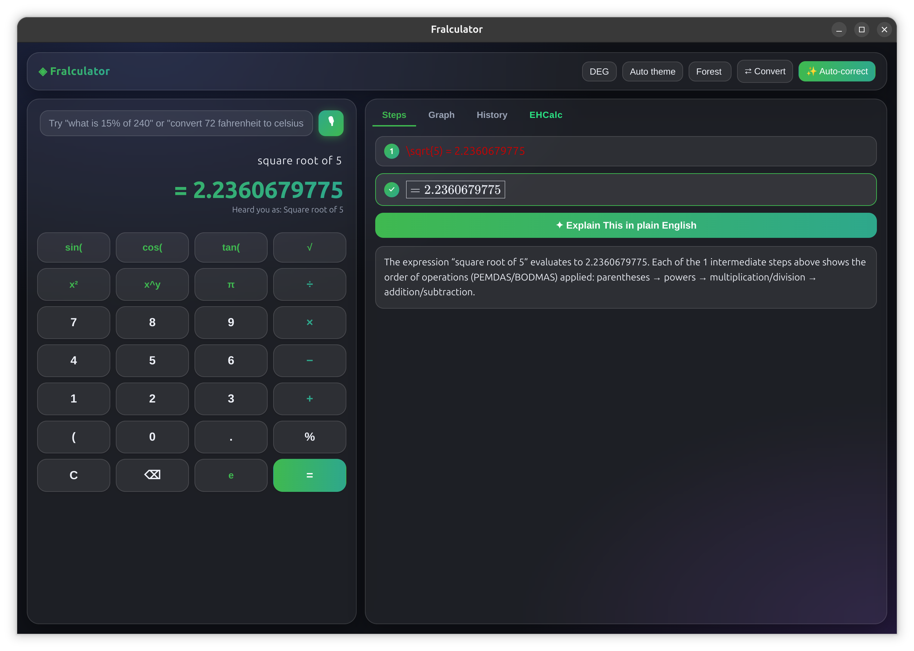
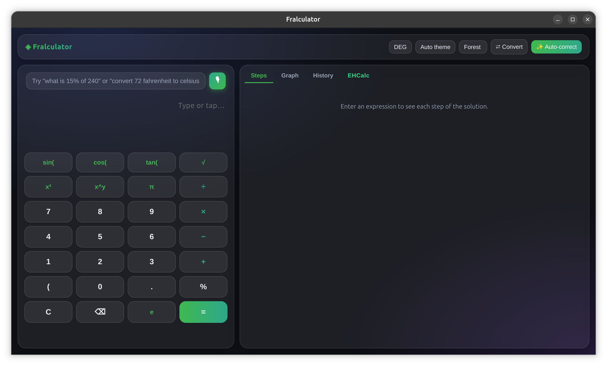
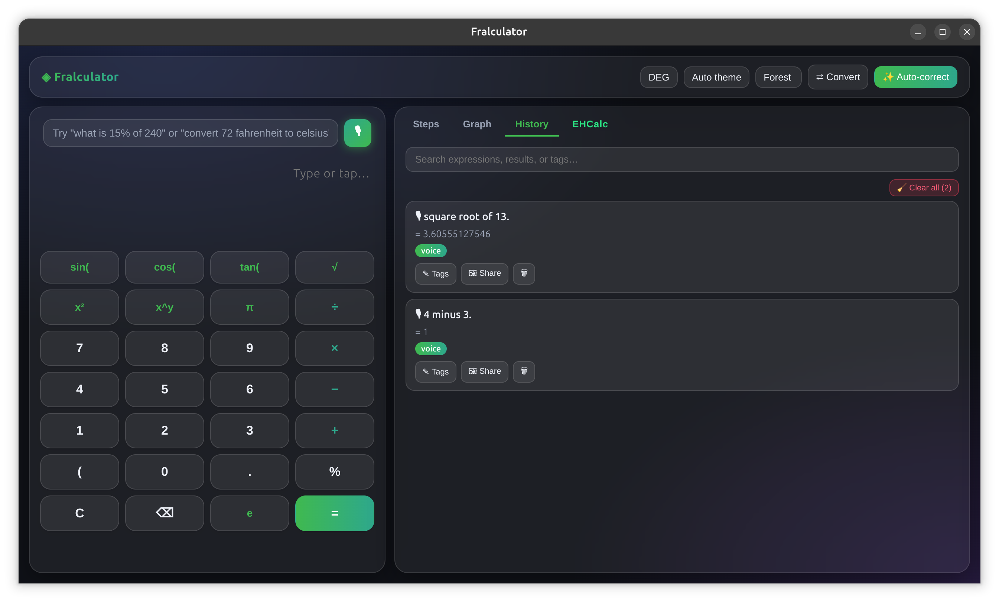
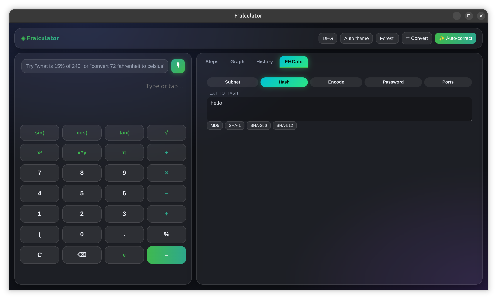
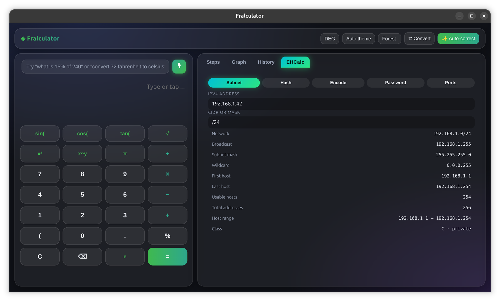
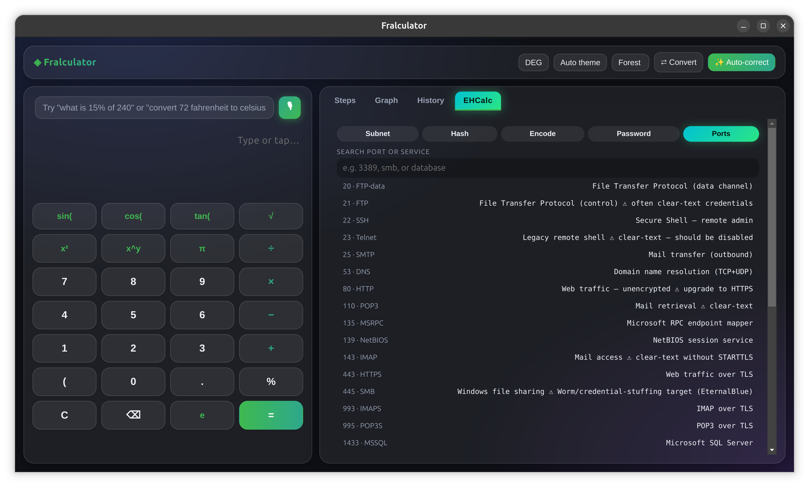

# ◈ Fralculator

[](https://github.com/fralsare/fralculator/actions/workflows/ci.yml)
[](./LICENSE)
[](./README.md)




Offline-first, step-by-step desktop calculator with live graphing, unit
conversion, voice input and the EHCalc security toolkit.
**Windows + Linux.** AI-ready.

Electron + React + Vite + TypeScript.

> Everything runs offline: the math engine, natural-language input, graphing,
> voice (Whisper WASM), and the EHCalc toolkit all work with no backend.
> The **AI-ready** part: backend registries are in place for a local LLM
> (`src/math/naturalLanguage.ts`, `src/ai/explain.ts`) — see the
> [Roadmap](#roadmap) below.

## Screenshots

| | |
|---|---|
|  |  |
| **Live graph** | **History, tags & sharing** |
|  |  |
| **EHCalc · Hash** | **EHCalc · Encode** |
|  |  |
| **EHCalc · Password** | **EHCalc · Ports** |

## Features

| Feature | Status |
|---|---|
| Step-by-step solutions (KaTeX rendered) | ✅ every intermediate step of any expression |
| Natural-language input (offline) | ✅ "what is 15% of 240", "two hundred and fifty times three", "convert 72 fahrenheit to celsius" |
| Live graphing (Plotly) | ✅ type `sin(x) * x` or any `f(x)` and it plots |
| Unit & currency conversion drawer | ✅ 11 categories (length…pressure) + live ECB currency rates (free Frankfurter API) |
| History with search & tags | ✅ persistent (localStorage), taggable, click-to-reload |
| Share as styled image | ✅ renders a branded card → PNG download |
| "Explain This" button | ✅ rule-based plain-English, real-life explanations (offline); LLM backend slot |
| Voice input | ✅ offline Whisper-tiny (WASM) in a worker; fully local after a one-time ~40 MB model download |
| Autocorrect | ✅ fixes typos in typed input (`5x3`→`5×3`, `**`→`^`, unbalanced `(`) and cleans voice transcripts; toggle in header |
| EHCalc (cyber / eth-hacking tools) | ✅ subnet calculator, MD5/SHA-1/256/512 hashing, encoders (Base64, Hex, URL, ROT13, Atbash, ASCII), password strength, password generator (strong/medium/weak rating), port lookup |
| Themes | ✅ dark / light / auto + 8 color palettes, glassmorphism UI |
| Local LLM (transformers) | 🔌 backend registry ready — see `src/math/naturalLanguage.ts` / `src/ai/explain.ts` |

## Develop

```bash
npm install
npm run dev            # Vite dev server at :5173
npm run dev:electron   # terminal 2: launches Electron pointed at the dev server
```

## Run the built app

```bash
npm start              # build + launch Electron
```

## Package installers

```bash
npm run dist:win       # NSIS installer + portable .exe (run on Windows)
npm run dist:linux     # AppImage + .deb + .rpm
```

Output lands in `release/`.

**Automated releases:** pushing a tag (e.g. `v0.1.0`) runs the `Release`
GitHub Actions workflow, which builds Windows + Linux installers on cloud
runners and publishes them to a GitHub Release automatically — no local
build needed (or trigger it manually: *Actions → Release → Run workflow*).

## Privacy

- Math, graphing, history, EHCalc, and explanations run **100% locally**.
- Voice: the Whisper-tiny WASM model is downloaded once (~40 MB) and cached
  in IndexedDB; audio never leaves the machine.
- The only network calls are the ECB currency rates (Frankfurter API, on
  demand) and that one-time model download. Nothing is sent to a backend.
- Generated passwords use `crypto.getRandomValues` and are never stored
  anywhere.

## Roadmap

- [ ] Plug a real local LLM into the backend registries
      (`src/math/naturalLanguage.ts`, `src/ai/explain.ts`)
- [ ] More NL phrase patterns and number words (thousands, decimals)
- [ ] Export/import history as JSON
- [ ] Mac build (arm64 + x64)
- [ ] Test suite for the math engine and EHCalc tools

## User Guide

A complete how-to for every feature — see [USER_GUIDE.md](./USER_GUIDE.md).

## License

MIT — see [LICENSE](./LICENSE).

## Architecture

```
text
electron/
  main.js        main window
  preload.js     context bridge (platform info)
src/
  math/
    engine.ts            tokenizer → parser (AST) → evaluator with step trace
    naturalLanguage.ts   offline rule engine + NLBackend registry (LLM slot)
  ai/explain.ts          "Explain This" backends (rule-based + LLM slot)
  units/data.ts          11 unit categories with base-unit conversion math
  cyber/                 subnet math, MD5/SHA hashing, encoders, password strength, ports
  store.ts               zustand + persist (history, tags, theme, angle mode)
  theme.ts               dark/light/auto + palette CSS variables
  components/            Display, Keypad, Steps (KaTeX), Graph (Plotly),
                         History, UnitsDrawer, VoiceButton, Header, Cyber (EHCalc)
```

### Math engine notes
- Grammar: `+ - × ÷ ^ %` (postfix percent), parentheses, implicit multiplication
  (`2x`, `(a)(b)`, `3sin(x)`), unary minus, functions
  `sin cos tan asin acos atan sqrt cbrt ln log abs floor ceil`, constants `pi e tau`.
- Trig defaults to **degrees** (DEG/RAD toggle in the header).
- Variables (e.g. `x`) evaluate only when provided — that's how the graph tab
  samples 600 points per plot.
- Evaluation records a human-readable step trace (PEMDAS order), skipping
  trivial steps like `x + 0` or `x × 1`.

### Upgrading to a real local LLM
`src/math/naturalLanguage.ts` and `src/ai/explain.ts` expose backend
registries. Add a backend that lazily imports
`@xenova/transformers` (WASM — no native build issues in Electron) in a worker:

```ts
import { pipeline } from '@xenova/transformers';
// e.g. Xenova/llama3.2-1B or a small instruct model, loaded on first use
```

Then register it in `backends` / `aiBackends`; the UI needs no changes.

### Offline voice
`VoiceButton` streams mic audio to a Web Worker running Whisper-tiny (WASM).
First run downloads the ~40 MB model and caches it in IndexedDB — fully
offline afterwards. Results auto-commit to history tagged `voice`.

<h2 align="center" style="color:#2ea043">🙏 Support the Project</h2>

<p style="color:#2ea043"><b>Fralculator is developed in my free time while I'm pursuing cybersecurity studies.</b> If the app saves you time or you just like it, donations are the best way to keep it growing — every bit goes toward my studies and to keeping the project free and open-source.</p>

| Method | Link |
|---|---|
| Quick payment (Razorpay link) | <b><a href="https://razorpay.me/@fralsare">razorpay.me/@fralsare</a></b> |
| Payment page | <b><a href="https://rzp.io/rzp/TdksERz">rzp.io/rzp/TdksERz</a></b> |
